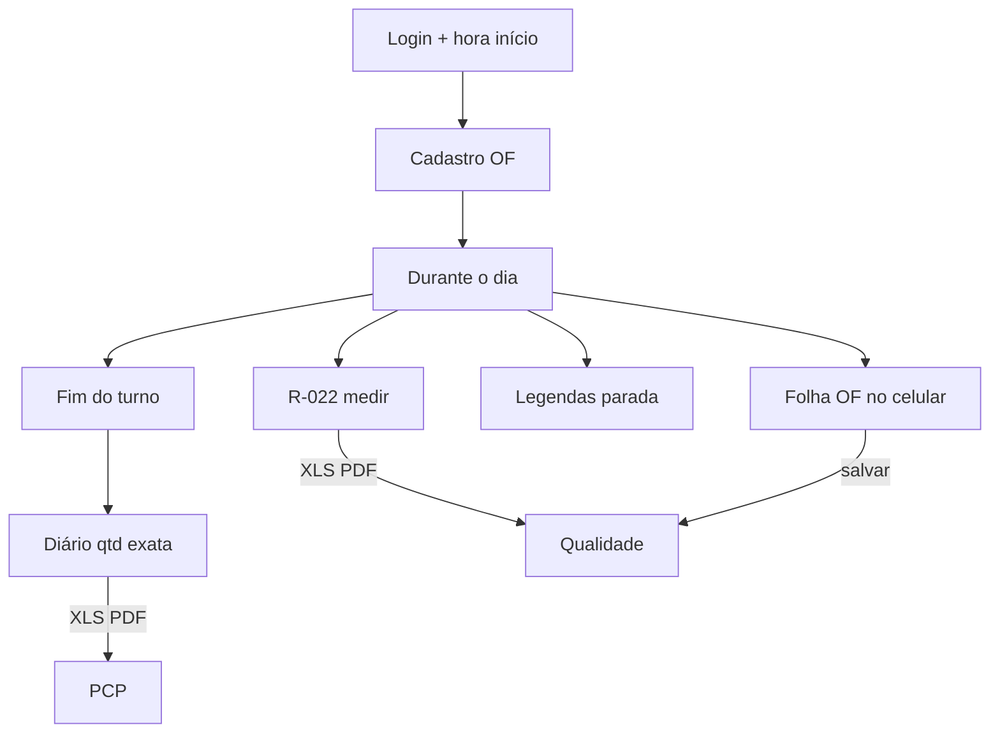

# TOME Produção

**Sistema offline de Diário de Bordo, R-022 e Folha de Ordem de Fabricação**  
TOME S/A — Usinagem

[](./Tome_Producao.apk)
[](https://flutter.dev)
[](./LICENSE)

| | |
|---|---|
| **APK** | [`Tome_Producao.apk`](./Tome_Producao.apk) |
| **Pacote** | `com.tome.producao` |
| **Público** | Operador no chão de fábrica (tablet compartilhado) |
| **Irmão** | [APK-LIDER](https://github.com/ALN2025/APK-LIDER) |
| **Atualização** | 04/08/2026 |

---

## Fluxo do turno (prática)

```
1. Entra no app → hora de início + OF / máquina / peça
2. Começa a usinar → 1ª peça já vai no R-022 (mede o dia todo)
3. Parou (almoço etc.) → Legendas: De / Até
   (pode adiantar refeição e limpeza com horário fixo)
4. Voltou → usina + R-022 de novo
5. Fim do dia:
   • Salva R-022 (qtd = peças medidas) → Qualidade
   • Diário: lança qtd EXATA → XLS + PDF → PCP
   • Folha OF: preenche e só SALVA (fica no celular)
6. Bater ponto → fecha o app e limpa o turno
```

| Arquivo enviado | Conteúdo | Destino |
|-----------------|----------|---------|
| **Diário** XLS/PDF | Quantidade + paradas (Legendas) | **PCP** |
| **R-022** XLS/PDF | Cotas do dia (qtd real de peças) | **Qualidade** |
| **Folha OF** XLS/PDF | Roteiro da OF (quando salvar) | **Qualidade** (separado do R-022) |

> Salvar **não fecha** o app. Só **Bater ponto** fecha e limpa.

---

## Abas

| Aba | Uso |
|-----|-----|
| **Diário** | Fim do turno: qtd exata + botões **XLS** / **PDF** |
| **R-022** | Durante o dia: mede peça a peça + **XLS** / **PDF** |
| **Ordem** | Folha OF no celular — lança e salva quando quiser |
| **Legendas** | Só marcar parada + consultar códigos (**sem** export) |

---

## Mapa



---

## Stack

| Camada | Tecnologia |
|--------|------------|
| UI | Flutter / Dart 3 (Material 3) |
| Banco | SQLite (`sqflite`) |
| Excel | `excel` (.xlsx) |
| PDF | `pdf` + Noto Sans |
| Envio | `share_plus` (Bluetooth / arquivo) |
| Flavor | `producao` (`com.tome.producao`) |

---

## Instalação

1. Desinstale a versão antiga.  
2. Instale [`Tome_Producao.apk`](./Tome_Producao.apk).  

---

## Compilar

```bash
flutter build apk --release --flavor producao --dart-define=FLAVOR=producao
```

---

## Assinatura

<p align="center">
  
</p>

<p align="center"><b>Dev A.L.N</b> · TOME S/A · 2026</p>

- Produção: https://github.com/ALN2025/APK-PRODUCAO  
- Líder: https://github.com/ALN2025/APK-LIDER  
