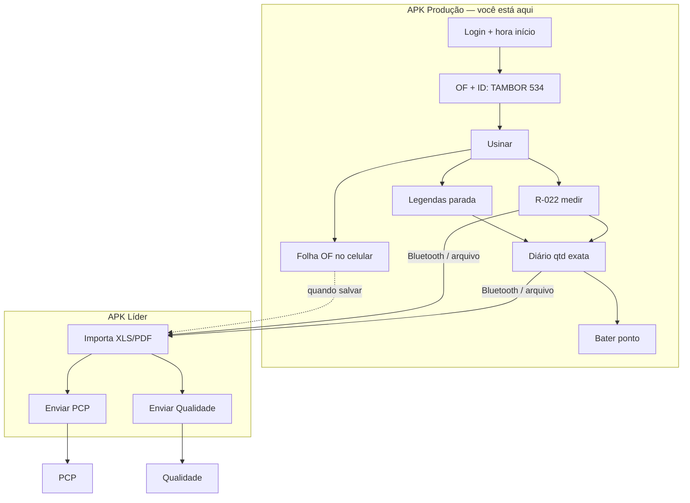

<div align="center">


# TOME Produção

### Diário · R-022 · Folha OF — chão de fábrica  
**TOME S/A · Usinagem**

[](./Tome_Producao.apk)
[](https://github.com/ALN2025/APK-LIDER)
[](https://flutter.dev)

`com.tome.producao` · offline · tablet da usinagem

</div>

---

## O que este APK faz

App do **operador**. Lança produção no turno e **envia arquivos ao líder**.  
**Não envia ao PCP** — isso é só no [APK Líder](https://github.com/ALN2025/APK-LIDER).

| Aba | Durante o dia | No fim |
|-----|---------------|--------|
| **R-022** | Mede peça a peça | XLS + PDF → **líder** |
| **Legendas** | Paradas De/Até (refeição, limpeza…) | Entram no Diário |
| **Diário** | — | Qtd **exata** boas + sucata → **líder** |
| **Ordem** | Folha OF no celular | Salva / envia ao **líder** quando quiser |

---

## Fluxo completo



```
 OPERADOR                         LÍDER
 ────────                         ─────
 salva Diário  ──────XLS/PDF───►  importar ──► Enviar PCP ──────► PCP
 salva R-022   ──────XLS/PDF───►  importar ──► Enviar Qualidade ► Qualidade
 Folha OF      ──────XLS/PDF───►  (opcional) ─► Qualidade
 Bater ponto   → limpa Diário+R-022 | Folha OF PERMANECE
```

---

## Bater ponto

- Apaga **Diário** e **R-022** do turno  
- **Folha OF permanece** no celular (mesma OF)  
- Fecha o app  

---

## Download

### [`Tome_Producao.apk`](./Tome_Producao.apk)

1. Desinstale a versão antiga  
2. Instale o APK  
3. Nome + Setor → máquina + **ID da peça** + ordem de usinagem  

---

## Stack

| | |
|---|---|
| UI | Flutter / Dart 3 · Material |
| Banco | SQLite (`sqflite`) |
| Excel | `excel` (.xlsx) |
| PDF | `pdf` + Noto Sans |
| Envio | `share_plus` · Bluetooth / arquivo |
| Flavor | `producao` |

---

<div align="center">

<br/>


### Desenvolvido por **Dev A.L.N**

[github.com/ALN2025](https://github.com/ALN2025) · TOME S/A · 2026

</div>
