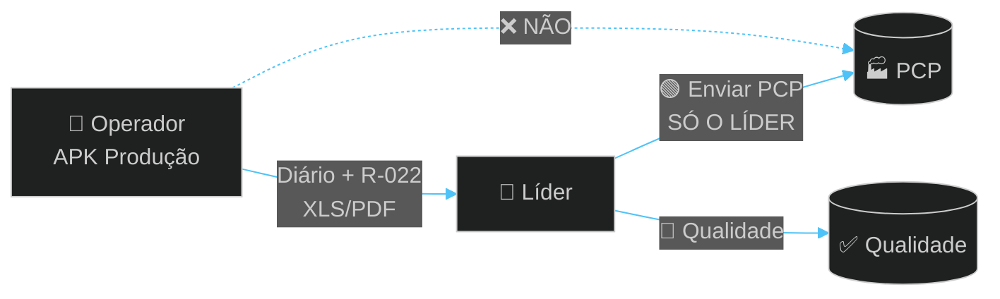
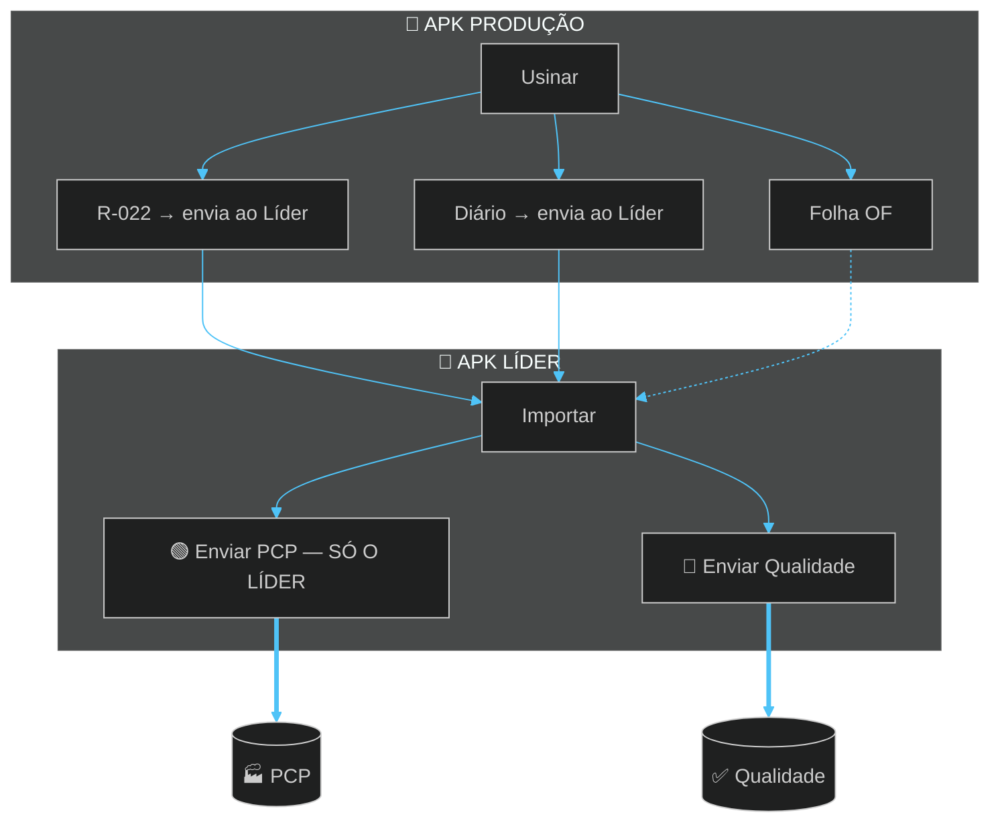

# TOME Produção

### Diário · R-022 · Folha OF — chão de fábrica  
**TOME S/A · Usinagem**

`com.tome.producao` · offline · tablet da usinagem

---

 

# 🔀 FLUXO — SÓ O LÍDER ENVIA AO PCP

> **Operador** manda Diário e R-022 ao **Líder** (pode a qualquer hora).  
> **Ninguém do chão envia direto ao PCP** — isso é só no APK Líder.

 

 

 

| Quem | Pode fazer | Destino |
|------|------------|---------|
| **Operador** | Enviar Diário + R-022 | → **Líder** |
| **Operador** | ❌ Enviar ao PCP | — |
| **Líder** | **Enviar PCP** | → **PCP** |
| **Líder** | Enviar Qualidade | → **Qualidade** |

---

## Turno

1. Login + OF + ID tambor  
2. **R-022** peça a peça → envie ao Líder quando quiser  
3. **Legendas** se parar  
4. Fim → **Diário** → Líder  
5. **Bater ponto** limpa Diário+R-022 · OF fica  

---

### [`Tome_Producao.apk`](./Tome_Producao.apk)

### Desenvolvido por **Dev A.L.N** · TOME S/A · 2026

