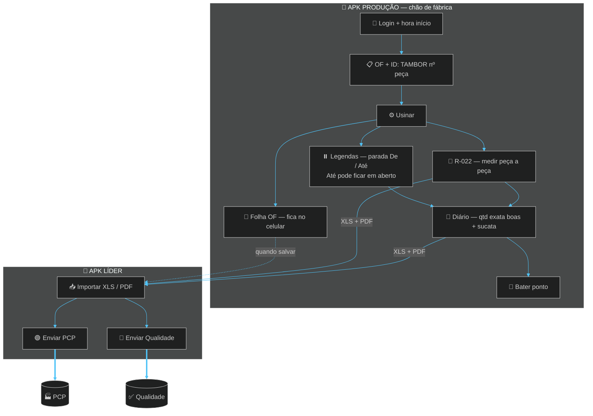
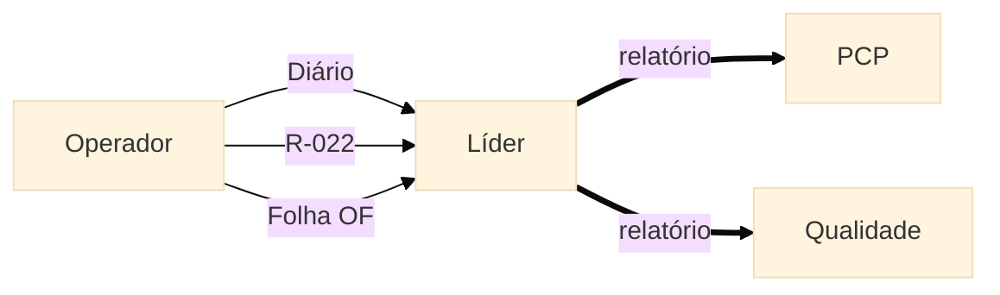

# TOME Produção

### Diário · R-022 · Folha OF — chão de fábrica  
**TOME S/A · Usinagem**

`com.tome.producao` · offline · tablet da usinagem

---

 

# 🔀 FLUXOGRAMA DO SISTEMA

> **Operador envia ao LÍDER → só o Líder manda ao PCP / Qualidade**

 

 

 

| Quem | Faz | Destino |
|------|-----|---------|
| **Produção** | Salva XLS/PDF | → **Líder** |
| **Líder** | Enviar PCP | → **PCP** |
| **Líder** | Enviar Qualidade | → **Qualidade** |

---

## Turno no tablet

1. Entra → hora + **ID: TAMBOR 534** + OF  
2. Usina → **R-022** a cada peça  
3. Parou (empilhadeira etc.) → **Legendas**: De agora, **Até depois** (lápis)  
4. Fim → **Diário** qtd exata → envia ao líder  
5. **Folha OF** fica no celular  
6. **Bater ponto** limpa Diário+R-022 · OF permanece  

---

## Download

### [`Tome_Producao.apk`](./Tome_Producao.apk)

---

## Stack

Flutter · SQLite · excel · pdf · share_plus · flavor `producao`

---

### Desenvolvido por **Dev A.L.N**

[github.com/ALN2025](https://github.com/ALN2025) · TOME S/A · 2026

