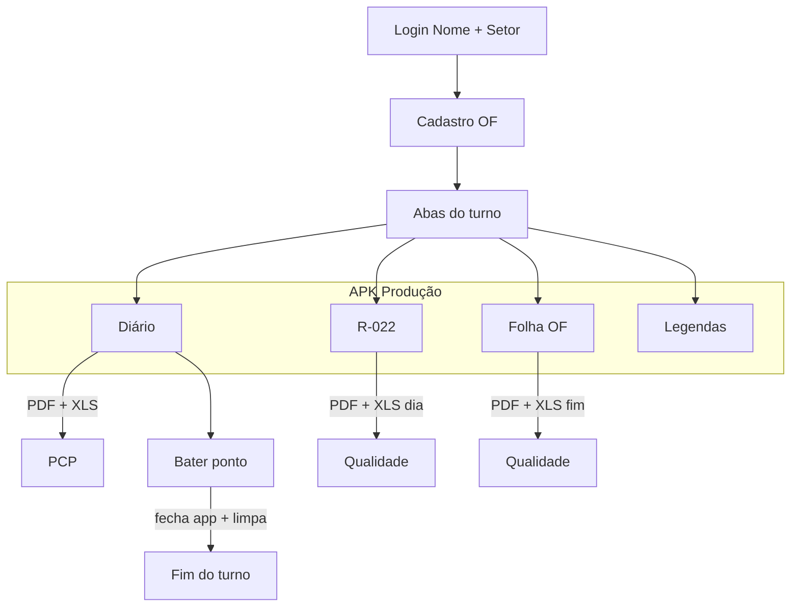

# TOME Produção

**Sistema offline de Diário de Bordo, R-022 e Folha de Ordem de Fabricação**  
TOME S/A — Usinagem

[](./Tome_Producao.apk)
[](https://flutter.dev)
[](./LICENSE)

| | |
|---|---|
| **APK** | [`Tome_Producao.apk`](./Tome_Producao.apk) |
| **Pacote** | `com.tome.producao` |
| **Público** | Operador no chão de fábrica (tablet compartilhado) |
| **Irmão** | [APK-LIDER](https://github.com/ALN2025/APK-LIDER) |

---

## Visão geral

App **100% offline** que substitui o papel na usinagem:

| Módulo | Documento | Destino do PDF/XLS |
|--------|-----------|-------------------|
| **Diário** | Produção, paradas, sucata | **PCP** |
| **R-022** | Cotas críticas do dia | **Qualidade** (planilha diária) |
| **Ordem** | Folha OF (roteiro Focco) | **Qualidade** (fim da OF — **envio separado**) |
| **Legendas** | Consulta de códigos | — |

> Salvar / enviar **não fecha** o app. Só **Bater ponto** (Diário) fecha o aplicativo e limpa o turno.

---

## Mapa de fluxo



```
Cadastro OF
   ├─ Diário   ──PDF/XLS──► PCP
   ├─ R-022    ──PDF/XLS──► Qualidade (dia)     ← separado
   └─ Folha OF ──PDF/XLS──► Qualidade (fim OF)  ← separado
```

Envio no chão: **Bluetooth / arquivo** (sem WhatsApp no tablet de produção).

---

## Campos da OF (cadastro)

| Campo | Obrigatório | Onde pega no papel |
|-------|-------------|--------------------|
| Máquina | Sim | Número do torno (ex.: 24, 1507) |
| ID / Código da peça | Sim | Item (ex.: T-144) |
| **Ordem de usinagem** | Sim | **OF** no cabeçalho (ex.: 125560) |
| Ordem de fundição | Não | Se houver |
| **Nº Documento / Barras** | Não | Código de barras no **topo** da “Emissão de Ordem de Fabricação” (ex.: `*484693*`). Se não souber, **deixe em branco** |
| Instrumentos R-022 | — | Micrômetro / RC |

---

## Stack tecnológica

| Camada | Tecnologia |
|--------|------------|
| UI | **Flutter** (Material 3), Dart 3 |
| Persistência | **SQLite** (`sqflite`) |
| Export Excel | **excel** (`.xlsx`) |
| Export PDF | **pdf** + fontes **Noto Sans** (acentos) |
| Compartilhar | **share_plus**, Bluetooth / arquivo |
| Arquivos | **path_provider**, **file_picker** |
| QR | **qr_flutter** |
| Ícones | Material Icons |
| Build Android | Flavors `producao` / `lider` (`--dart-define=FLAVOR=`) |

### Dependências principais

```
flutter / dart
sqflite · path · path_provider
share_plus · file_picker
pdf · excel · intl · qr_flutter
```

---

## Instalação

1. Desinstale a versão anterior.
2. Permita instalar apps desconhecidos.
3. Instale [`Tome_Producao.apk`](./Tome_Producao.apk).
4. Nome + Setor → preencha OF → use as abas.

Arquivos gerados: pasta `Download/Tome` (quando possível) e área do app.

---

## Compilar

```bash
cd tome_producao
flutter pub get
flutter build apk --release --flavor producao --dart-define=FLAVOR=producao
```

Saída: `build/app/outputs/flutter-apk/app-producao-release.apk`

---

## Assinatura

Rodapé do aplicativo:

<p align="center">
  
</p>

<p align="center"><b>Dev A.L.N</b> · TOME S/A · 2026</p>

---

## Repositórios

- Produção: https://github.com/ALN2025/APK-PRODUCAO  
- Líder: https://github.com/ALN2025/APK-LIDER  
